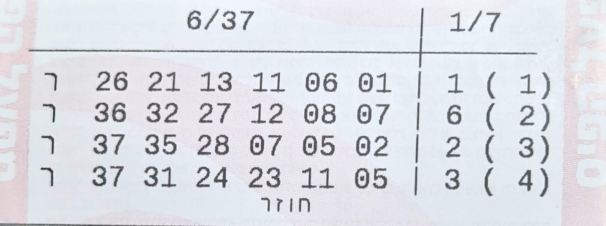

# Local Lotto OCR

Local Lotto OCR is a high-performance ticket scanning tool designed to extract lottery numbers from images.

It uses a hybrid recognition pipeline combining:

* **Tesseract OCR**
* **OpenCV computer vision**
* **AI verification (OpenAI API)**

The goal of the project is to provide fast, reliable lottery ticket parsing while handling common OCR edge cases.

---

## What the Tool Does

Local Lotto OCR processes lottery ticket images and returns structured number data.

The system can:

* detect ticket layout and rows
* segment individual number boxes
* extract numbers using OCR
* correct common OCR mistakes
* verify uncertain digits using AI (optional)
* output structured JSON results

The hybrid pipeline allows fast processing while still maintaining high accuracy when characters are ambiguous.

---

## Example Input

Provide a local image path or URL for a ticket image.

Example test file included in the project:

```
example_lotto.jpg


```

---

## Example Output

The program returns extracted numbers in structured JSON.

```json
{
  "rows": [
    {
      "numbers": [3, 12, 18, 27, 31, 34],
      "strong": 7
    },
    {
      "numbers": [1, 9, 14, 22, 29, 35],
      "strong": 5
    }
  ]
}
```

---

## Core Features

### Parallel Row Processing

Ticket rows are scanned simultaneously to improve throughput and reduce total processing time.

### Hybrid Recognition Engine

The OCR pipeline combines:

* template matching for speed
* Tesseract OCR for text recognition
* AI verification for ambiguous digits

This layered approach improves both speed and reliability.

### OCR Error Correction

The system automatically corrects common digit confusion cases such as:

* `7` vs `1`
* `0` vs `8`
* `3` vs `8`

### Smart Ticket Parsing

The layout engine can correctly identify:

* ticket headers
* row boundaries
* fraction formats (e.g. `6/37`)
* strong / bonus numbers

---

## Tech Stack

* **Python 3.8+**
* **OpenCV**
* **Tesseract OCR**
* **NumPy**
* **OpenAI API (optional)**

---

## Project Structure

```
main.py
```

Entry point for the application.

Responsibilities:

* CLI interaction
* image path input
* invoking the OCR pipeline
* displaying results

```
lotto_extractor.py
```

Core extraction pipeline.

Responsibilities:

* row detection
* parallel processing
* coordinating OCR operations

```
image_utils.py
```

Image preprocessing utilities.

Responsibilities:

* grayscale conversion
* deskewing
* image loading

```
layout_analysis.py
```

Ticket layout detection.

Responsibilities:

* locating rows
* detecting digit bounding boxes
* segmentation logic

```
ocr_engine.py
```

Digit recognition engine.

Responsibilities:

* template matching
* Tesseract OCR integration
* OCR confidence handling

```
ai_client.py
```

Optional AI verification layer.

Responsibilities:

* sending ambiguous digits to OpenAI
* selecting corrected digit candidates

```
config.py
```

Central configuration module.

Responsibilities:

* paths
* thresholds
* runtime constants

```
Digits/
```

Reference images for digits `0-9` used by the template matching engine.

---

## Prerequisites

### Python 3.8+

Download Python:

https://www.python.org/downloads/

Ensure Python is added to your **system PATH**.

---

### Tesseract OCR

The OCR engine must be installed separately.

Windows installer:

https://github.com/UB-Mannheim/tesseract/wiki

Typical installation path:

```
C:\Program Files\Tesseract-OCR
```

---

## Tesseract Configuration

### Recommended Option

Add Tesseract to your **system PATH** so it can be called globally.

### Portable Option

Copy the installed `Tesseract-OCR` folder directly into the project directory.

The script will automatically search for:

```
Tesseract-OCR/tesseract.exe
```

---

## Installation

Clone or download the project, then install dependencies.

```bash
pip install -r requirements.txt
```

---

## Running the Tool

Start the program:

```bash
python main.py
```

When prompted, enter the image path.

Example:

```
C:\Users\User\Desktop\local_ocr\example_lotto.jpg
```

You can also drag and drop the file directly into the terminal.

The extracted ticket numbers will be printed as structured JSON.

---

## Optional AI Verification

For maximum accuracy the tool can verify uncertain digits using the OpenAI API.

If no API key is provided, the program runs in **Local Only Mode** using:

* OpenCV template matching
* Tesseract OCR

---

## Setting the API Key

Create an API key:

https://platform.openai.com/

Then set the environment variable.

### Windows PowerShell

```powershell
$env:OPENAI_API_KEY="your-key"
```

### Windows CMD

```cmd
set OPENAI_API_KEY=your-key
```

### Mac / Linux

```bash
export OPENAI_API_KEY="your-key"
```

---

## Running in Local Only Mode

If no API key is configured, the program will still function fully using local OCR.

AI verification will simply be skipped.

---

## Intended Scope

This project focuses on **OCR accuracy and image processing**, not user-facing UI.

### Included

* ticket image parsing
* digit recognition
* OCR correction logic
* structured output
* optional AI verification

### Not Included

* GUI interface
* web frontend
* mobile app
* ticket database
* cloud storage

---

## Why This Project Exists

Local Lotto OCR was built as a technical project exploring:

* computer vision pipelines
* OCR reliability
* hybrid AI + classical CV systems
* Python image processing
* parallel processing design
* robust input parsing

The project demonstrates how traditional computer vision and AI can be combined to improve OCR accuracy on structured documents.
